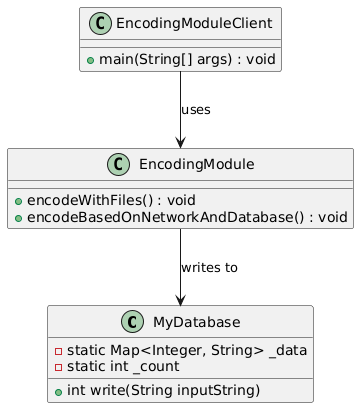
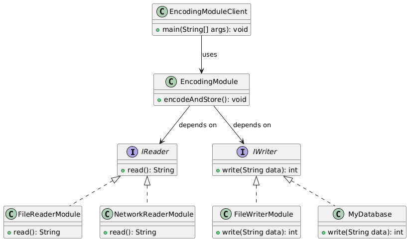
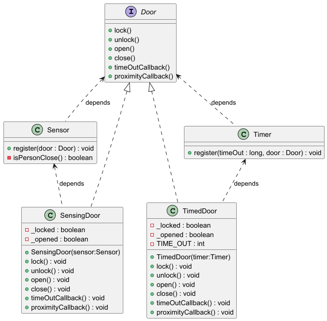
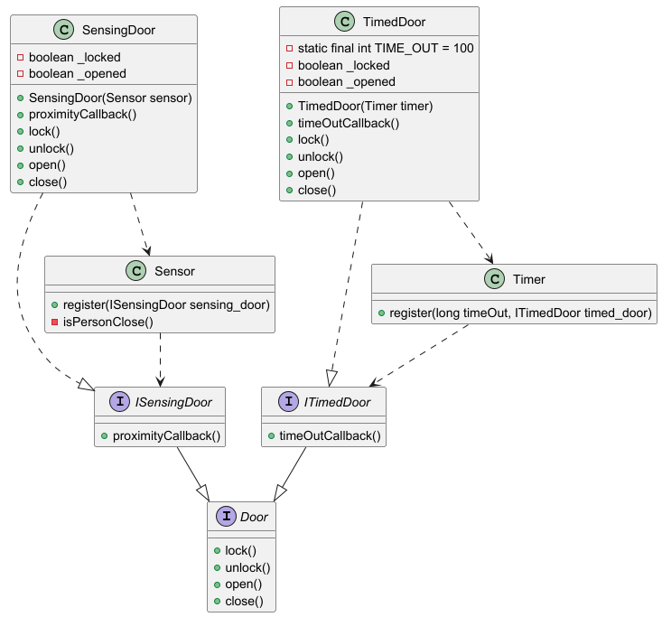
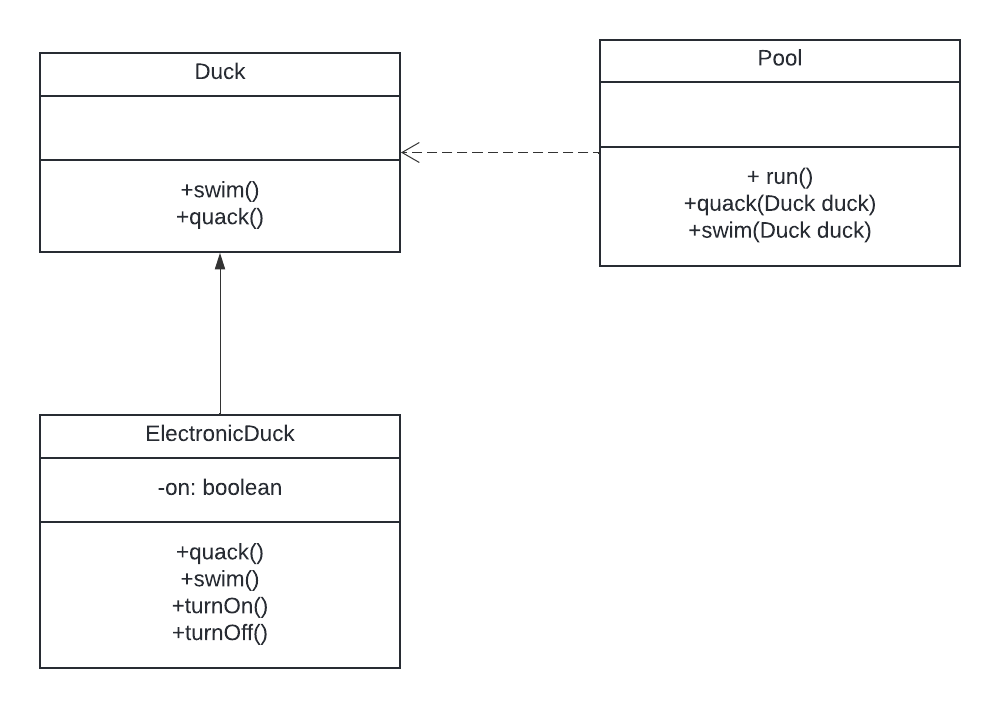
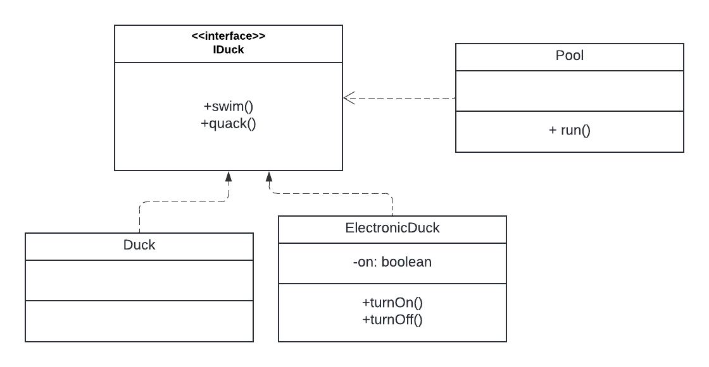
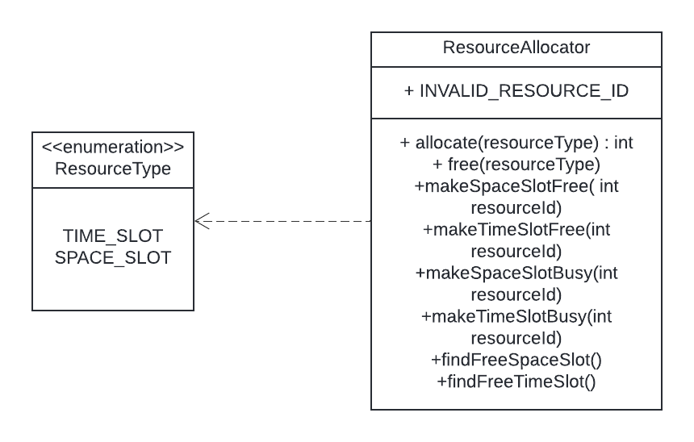
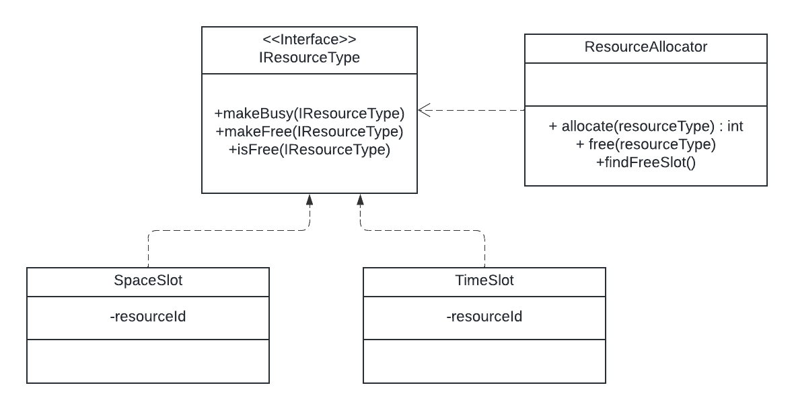
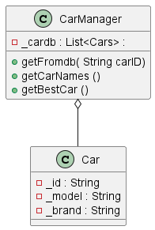
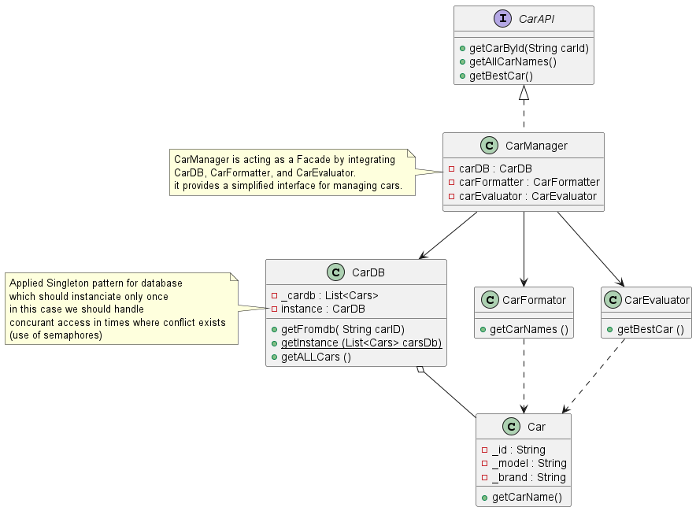

# Software-Architecture-Labs
## DIP : Dependecy Inversion Principle
### 📌 Analyse du code initial
Le code initial viole le principe de l'Inversion des Dépendances (DIP) du SOLID, car :

* **EncodingModule** dépend directement des classes concrètes (**MyDatabase, FileReader, FileWriter, BufferedReader, BufferedWriter, URL**).
* **EncodingModule** crée lui-même ses dépendances, ce qui le couple fortement à des implémentations spécifiques.
* Cette approche rend difficile la modification et l’extension du code sans impacter d’autres parties du programme.  

🔴 Problème principal : Le code dépend des détails (implémentations concrètes) au lieu de dépendre d’abstractions.

<br><br>


### ✅ Solution proposée
#### Séparation des responsabilités avec des interfaces
Deux interfaces ont été créées pour représenter les opérations de lecture et d’écriture :
* IReader : définit une abstraction pour la lecture de données.  
* IWriter : définit une abstraction pour l’écriture de données.  
Grâce à ces interfaces, **EncodingModule** ne connaît plus les détails des implémentations, ce qui réduit le couplage et facilite l’extension du code.
#### Implémentations concrètes des interfaces
Différentes classes implémentent ces interfaces, permettant plusieurs sources de lecture **(FileReaderModule, NetworkReaderModule)** et de stockage des données **(FileWriterModule, MyDatabase)**.
#### Intégration avec EncodingModule
EncodingModule est conçu pour recevoir dynamiquement un IReader et un IWriter via son constructeur.
Ainsi, il n’a plus besoin de connaître les classes concrètes : il peut travailler avec n’importe quelle implémentation des interfaces.
#### Injection des dépendances
Dans le programme principal **(EncodingModuleClient)**, les dépendances sont injectées dynamiquement.
Par exemple :
* On peut lire un fichier et stocker les données encodées dans un autre fichier.  
* On peut récupérer des données depuis un réseau et les enregistrer dans une base de données.  
* Les combinaisons sont infinies, et aucune modification de EncodingModule n’est requise pour en ajouter de nouvelles.  

<br><br>


### 📌 Conclusion
L’application du DIP dans cette solution garantit :  
✔ Un code modulaire et facilement extensible.  
✔ Une indépendance totale entre EncodingModule et les classes concrètes.  
✔ Une meilleure testabilité, car les dépendances peuvent être remplacées par des mocks.  
✔ Un code plus propre et maintenable, conforme aux principes SOLID.


## ISP : Interface Segregation Principle 
### Contexte Initial : Avant ISP

Dans l’implémentation actuelle, les classes **SensingDoor** et **TimedDoor** doivent implémenter toutes les méthodes de l’interface **Door**, même celles dont elles n’ont pas besoin :

- **SensingDoor** doit implémenter la méthode `timeOutCallback()`, qui ne lui est d’aucune utilité.
- **TimedDoor** doit implémenter la méthode `proximityCallback()`, qui n’a aucun sens pour elle non plus.

Cela entraîne une violation du principe de **Ségrégation des Interfaces** (ISP), qui stipule que "les clients ne doivent pas être contraints de dépendre d’interfaces qu’ils n’utilisent pas".
<br><br>


---

### Après l’application de l’ISP

Après l'application du principe de **Ségrégation des Interfaces** (ISP), le code est désormais mieux structuré et respecte ce principe fondamental :

- **L'interface Door** contient uniquement les méthodes essentielles nécessaires à toutes les portes (lock, unlock, open, close).
- Deux nouvelles interfaces spécifiques ont été créées :
    - **ISensingDoor**, qui ajoute la méthode `proximityCallback()`.
    - **ITimedDoor**, qui ajoute la méthode `timeOutCallback()`.

### Changements apportés :

- **SensingDoor** implémente désormais uniquement l'interface **ISensingDoor** et ne dépend plus de la méthode `timeOutCallback()`, qui n'était pas pertinente pour cette classe.
- **TimedDoor** implémente uniquement l'interface **ITimedDoor** et ne dépend plus de la méthode `proximityCallback()`, qui ne lui était pas utile.

  <br><br>


---

### Bénéfice :

Maintenant, chaque classe dépend uniquement des méthodes qu'elle utilise réellement, ce qui permet de respecter le principe **ISP** 


## LSP: Liskov Substitution Principle

Dans le code initial, la classe ElectronicDuck étend la classe Duck mais lance des exceptions lorsque le canard est éteint, ce qui viole le principe de Substitution de Liskov. 
La classe ElectronicDuck ne peut pas être utilisée de manière interchangeable avec la classe Duck sans provoquer de comportement inattendu.

<br><br>
<br><br>


=> Pour implémenter le principe LSP, on a introduit une interface IDuck qui définit les méthodes quack() et swim(). 
Les classes RealDuck et ElectronicDuck implémentent cette interface. La classe ElectronicDuck fournit maintenant un comportement par défaut lorsqu'elle est éteinte, garantissant qu'elle peut être utilisée de manière interchangeable avec RealDuck.

<br><br>


## OCP: Open/Close Principle
Dans le code initial de la classe ResourceAllocator, l'allocation et la libération des ressources étaient gérées à l'aide d'une instruction switch basée sur l'énumération ResourceType.
Cette approche viole le principe de l'Ouverture/Fermeture car l'ajout d'un nouveau type de ressource nécessite de modifier toutes les méthodes de la classe ResourceAllocator, ainsi que l'ajout d'une autre enumeration dans ResourceType.



=> Pour implémenter le principe Open/Close, on a refactorisé le code en ajoutant une interface IResourceType qui définit les méthodes pour l'allocation et la libération des ressources. 
Chaque type de ressource implémente cette interface. 
La classe ResourceAllocator fonctionne maintenant avec l'interface IResourceType, ce qui la rend "Open" à l'extension mais "Closed" à la modification.



## SRP: 
### Solution Initiale

### Solution proposée en appliquant SRP principe

Cette solution démontre comment appliquer le **Principe de Responsabilité Unique (SRP)** à un système de gestion de voitures tout en incorporant le **Patron de Conception Facade**. Le système gère les données des voitures, formate les noms des voitures et évalue la meilleure voiture en fonction de son modèle. Le code a été refactorisé pour séparer les responsabilités en différentes classes. La classe `CarManager` agit comme une façade et implémente l'interface `CarManagerAPI`, simplifiant ainsi l'interaction avec les autres services, et la base de données des voitures est gérée via le **Patron Singleton**.

## Structure du projet

Les classes sont organisées dans une structure de paquets plus raffinée :
```
com
 └── directi
     └── training
         └── srp
             └── proposed_solution
                 ├── api
                 │    ├── CarManagerAPI.java
                 │    └── implementation
                 │        └── CarManager.java
                 ├── database
                 │    └── CarDB.java
                 ├── models
                 │    └── Car.java
                 └── services
                      ├── CarEvaluator.java
                      └── CarFormatter.java

```

## Structure des classes

### 1. **Car.java (DTO)**

La classe `Car` est située dans le paquet `models` et représente une voiture. Elle contient les attributs suivants :

- **`id`** : L'identifiant unique de la voiture.
- **`model`** : Le nom du modèle de la voiture.
- **`brand`** : La marque de la voiture.

**Méthodes** :
- **`getCarName()`** : Retourne la concaténation de la marque et du modèle de la voiture (par exemple, `"Volkswagen Golf III"`).

---

### 2. **CarDB.java (Singleton)**

La classe `CarDB` est un singleton située dans le paquet `database`. Elle agit comme une base de données en mémoire pour le système de gestion de voitures, contenant une liste de voitures et offrant des méthodes pour interagir avec elles.

**Méthodes** :
- **`getInstance()`** : Assure qu'il n'y a qu'une seule instance de la classe `CarDB` (patron Singleton).
- **`getCarById(String carId)`** : Récupère une voiture par son identifiant dans la base de données.

---

### 3. **CarManagerAPI.java (Facade Interface)**

L'interface `CarManagerAPI`, située dans le paquet `api`, définit les opérations disponibles pour interagir avec le système de gestion des voitures. Elle offre une API simple et unifiée pour les consommateurs du système afin de récupérer des données de voitures, formater les noms des voitures et évaluer la meilleure voiture.

**Méthodes** :
- **`getCarById(String carId)`** : Récupère une voiture par son identifiant.
- **`getAllCarNames()`** : Récupère et formate tous les noms des voitures.
- **`getBestCar()`** : Récupère la meilleure voiture selon l'évaluation du modèle.

---

### 4. **CarManager.java (Implémentation de la Facade)**

La classe `CarManager`, située dans le paquet `api/implementation`, est la façade qui implémente l'interface `CarManagerAPI`. Elle fournit une interface simplifiée pour interagir avec le système et délègue les opérations aux services appropriés (par exemple, `CarEvaluator`, `CarFormatter`) ainsi qu'à la base de données `CarDB`.

**Méthodes** :
- **`getCarById(String carId)`** : Utilise `CarDB` pour récupérer la voiture par son identifiant.
- **`getAllCarNames()`** : Utilise `CarFormatter` pour formater et retourner tous les noms des voitures.
- **`getBestCar()`** : Utilise `CarEvaluator` pour déterminer la meilleure voiture parmi la liste des voitures.

---

### 5. **CarEvaluator.java**

La classe `CarEvaluator`, située dans le paquet `services`, est responsable de l'évaluation de la meilleure voiture en fonction du nom du modèle. Cette classe contient la logique pour comparer et déterminer la meilleure voiture.

**Méthodes** :
- **`getBestCar(List<Car> cars)`** : Itère à travers une liste de voitures et compare leurs modèles pour déterminer la "meilleure" voiture.

---

### 6. **CarFormatter.java**

La classe `CarFormatter`, située dans le paquet `services`, est responsable du formatage des noms des voitures. Elle itère à travers une liste de voitures et retourne une chaîne formatée contenant le nom de chaque voiture (marque + modèle), séparé par des virgules.

**Méthodes** :
- **`getCarsNames(List<Car> cars)`** : Formate la liste des noms de voitures en une seule chaîne.

---

## Avantages du refactoring SRP avec les patrons de conception Facade et Singleton

### 1. **Principe de Responsabilité Unique (SRP)**

Chaque classe a une seule responsabilité clairement définie :

- **`Car`** : Représente les données d'une voiture.
- **`CarDB`** : Gère la base de données (patron Singleton).
- **`CarManagerAPI`** : Définit l'API pour interagir avec le système de gestion des voitures.
- **`CarManager`** : Agit comme la façade, fournissant une interface simplifiée et délégant les responsabilités aux autres classes.
- **`CarEvaluator`** : Évalue la meilleure voiture.
- **`CarFormatter`** : Formate les noms des voitures.

### 2. **Patron Facade**

La classe `CarManager`fournit une API unifiée aux clients du système. Les consommateurs de l'interface `CarManagerAPI` n'ont pas besoin de connaître les services sous-jacents comme `CarEvaluator`, `CarFormatter` ou la base de données.

### 3. **Patron Singleton**

La classe `CarDB` garantit qu'il n'existe qu'une seule instance de la base de données des voitures, offrant un accès centralisé aux données des voitures.

---

Cette solution améliore la maintenabilité, la flexibilité et la testabilité du système de gestion de voitures en séparant les préoccupations dans des classes clairement définies, chacune ayant une responsabilité unique.
